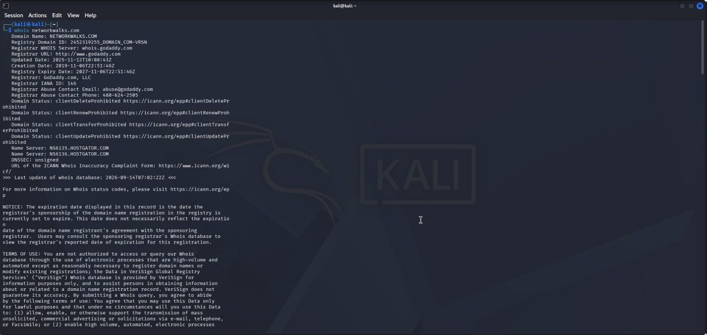
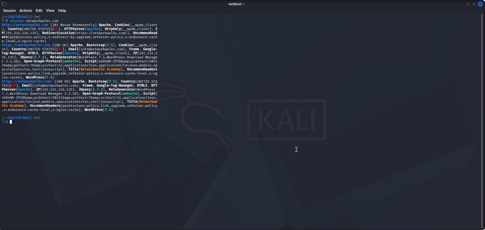
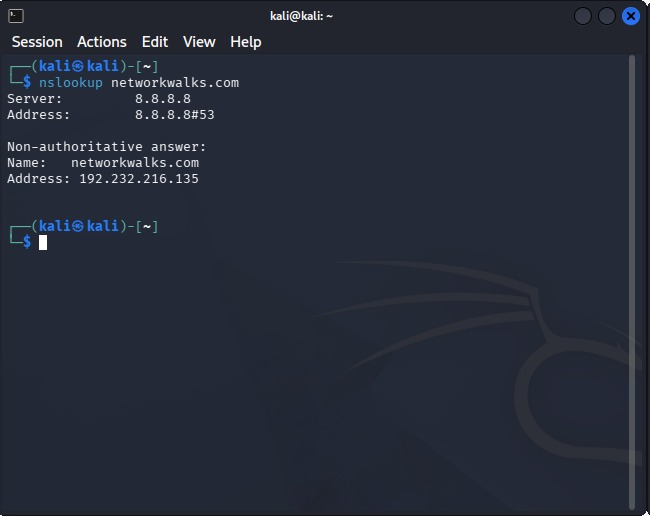
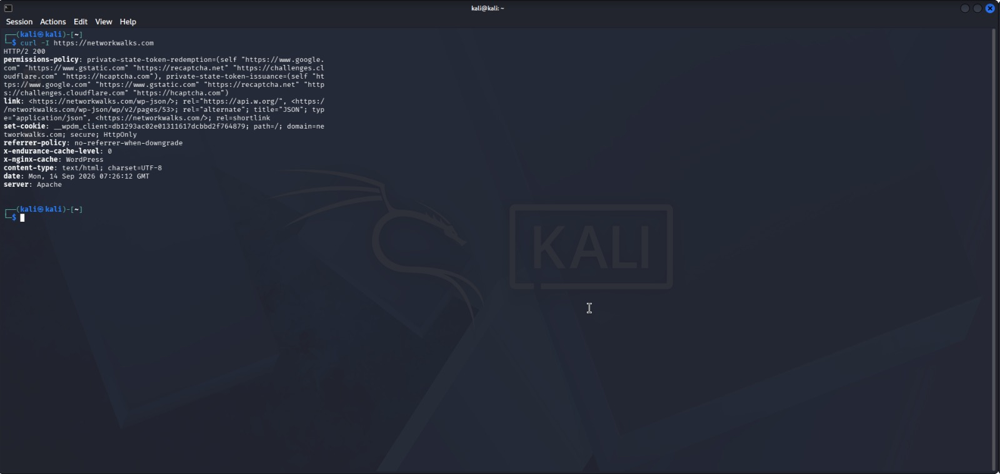
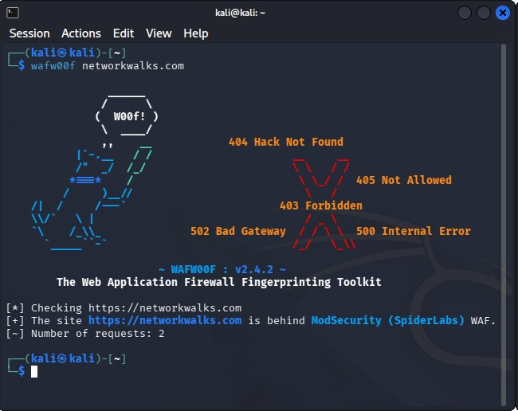
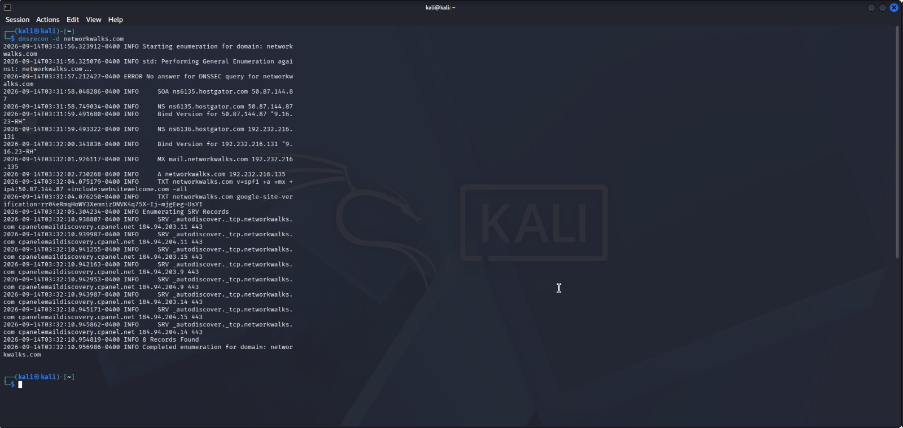
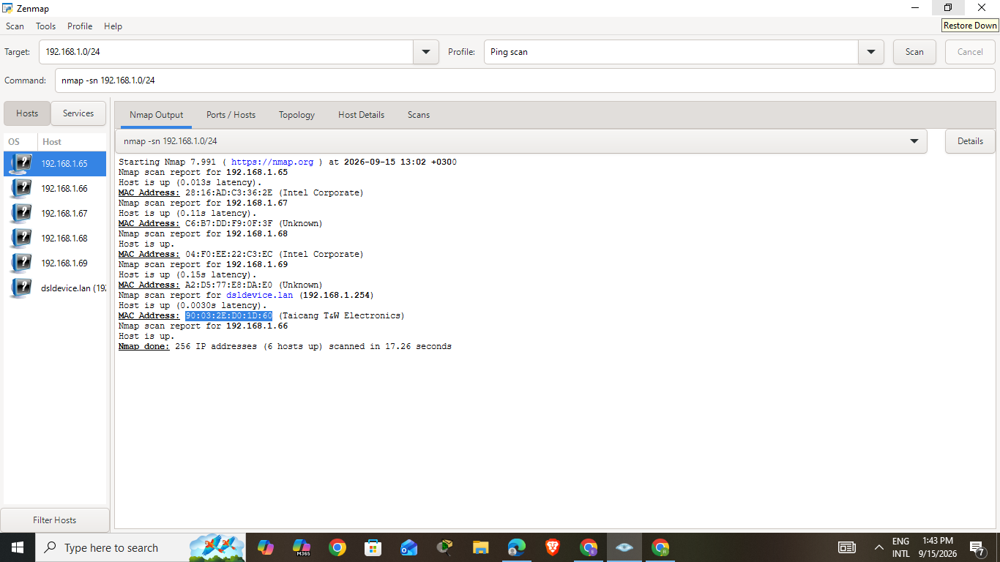
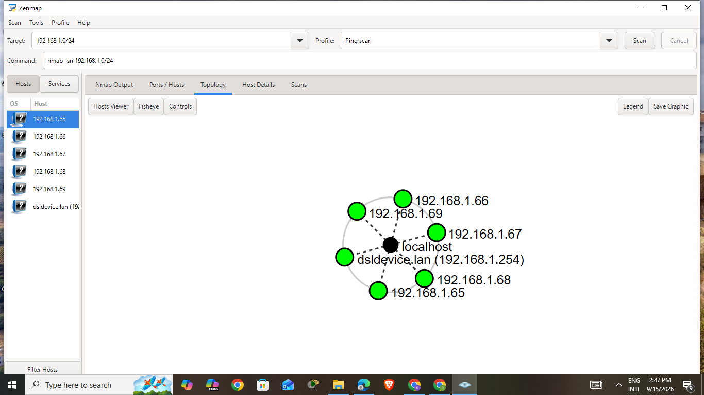

# Week 2 — Footprinting, Reconnaissance & Network Scanning


**Author:** Elza Chepkemoi
**Program:** Cybersecurity & Ethical Hacking Internship at [Networkwalks](https://networkwalks.com)
**Week:** 02
**LinkedIn:** [rotich-elza-3795ab411](https://www.linkedin.com/in/rotich-elza-3795ab411)

---

## 📌 Overview

This repository contains my Week 2 practical submission for the Networkwalks Cybersecurity Internship program. The practical covers two modules:

1. **W2-PM1 — Footprinting & Reconnaissance** of `networkwalks.com` using six Kali Linux tools.
2. **W2-PM5 — Network Scanning** of my local subnet using Zenmap (Nmap GUI).

The goal of these modules was to demonstrate how a security professional (or attacker) moves from passive information gathering to active host discovery.

---

## 🛠️ Tools Used

| Tool | Purpose |
|---|---|
| **WHOIS** | Domain registration details (registrar, dates, name servers) |
| **WhatWeb** | Web technology fingerprinting (CMS, plugins, server) |
| **Nslookup** | DNS resolution (domain → IP address) |
| **Curl -I** | HTTP response headers inspection |
| **Wafw00f** | Web Application Firewall detection |
| **DNSRecon** | DNS record enumeration (NS, MX, TXT, SRV) |
| **Zenmap (Nmap GUI)** | Local network host discovery & topology |
| **Windows CMD** | Local IP and MAC address identification |

---

## 🎯 Key Findings

### Footprinting (`networkwalks.com`)

| Finding | Value |
|---|---|
| Registrar | GoDaddy.com, LLC |
| Hosting Provider | HostGator |
| Resolved IP | `192.232.216.135` |
| CMS | WordPress 7.1 |
| Plugin | WordPress Download Manager 3.3.58 |
| Web Server | Apache |
| WAF | ModSecurity (SpiderLabs) |
| DNS Server | BIND 9.16.23-RH |
| DNS Records Found | 8 (SOA, NS, MX, A, TXT, SRV) |

### Network Scanning (`192.168.1.0/24`)

- **256 IPs scanned** in 17.26 seconds
- **6 hosts up** (including the local scanner)
- Router identified as `dsldevice.lan` (`192.168.1.254`)

| # | IP Address | MAC Address | Vendor |
|---|---|---|---|
| 1 | 192.168.1.65 | `28:16:AD:C3:36:2E` | Intel Corporate |
| 2 | 192.168.1.66 | `C6:57:DD:F9:0F:3F` | Unknown (MAC randomized) |
| 3 | 192.168.1.67 | `04:F0:EE:22:C3:EC` | Intel Corporate |
| 4 | 192.168.1.68 | `04:F0:EE:22:C3:EC` | Intel Corporate |
| 5 | 192.168.1.69 | `A2:D5:77:E3:DA:F0` | Unknown (MAC randomized) |
| 6 | 192.168.1.254 | `5C:03:2F:2D:9D:D0` | Taicang T&W Electronics (Router) |

---

## 📸 Evidence Gallery

### 1. WHOIS — Domain Registration

```bash
whois networkwalks.com
```



*Registrar: GoDaddy.com | Name Servers: NS6135.HOSTGATOR.COM, NS6136.HOSTGATOR.COM*

---

### 2. WhatWeb — Web Technology Fingerprinting

```bash
whatweb networkwalks.com
```



*Detected: WordPress 7.1, WP Download Manager 3.3.58, Apache, IP 192.232.216.135*

---

### 3. Nslookup — DNS Resolution

```bash
nslookup networkwalks.com
```



*Resolved: networkwalks.com → 192.232.216.135*

---

### 4. Curl -I — HTTP Response Headers

```bash
curl -I https://networkwalks.com
```



*Exposed: `/wp-json/` REST API endpoint, X-Nginx-Cache: WordPress, server: Apache*

---

### 5. Wafw00f — WAF Detection

```bash
wafw00f networkwalks.com
```



*Detected: ModSecurity (SpiderLabs) WAF*

---

### 6. DNSRecon — DNS Record Enumeration

```bash
dnsrecon -d networkwalks.com
```



*Found: 8 records (SOA, NS, MX, A, TXT, SRV) | DNS: BIND 9.16.23-RH*

---

### 7. Zenmap — Ping Scan (Local Network)

```cmd
ipconfig
```

Then in Zenmap:
- **Target:** `192.168.1.0/24`
- **Profile:** `Ping scan`



*Result: 6 hosts up — 192.168.1.65, .66, .67, .68, .69, .254 (router)*

---

### 8. Zenmap — Network Topology



*Network topology of the 192.168.1.0/24 subnet, generated and exported from Zenmap.*

---

## ⚠️ Risk Summary

| # | Risk | Level |
|---|---|---|
| 1 | Outdated WordPress core & plugin versions exposed | **Medium** |
| 2 | Hosting provider identifiable via WHOIS | Low |
| 3 | Server IP publicly identifiable | Low |
| 4 | WordPress REST API + page IDs exposed | **Medium** |
| 5 | WAF vendor identifiable | Low |
| 6 | DNS & mail infrastructure exposed | **Medium** |
| 7 | Public contact email exposed | Low |
| 8 | Multiple live hosts visible on local network | **Medium** |

> These are **observations**, not confirmed vulnerabilities. No exploitation was performed.


---

## 🚀 How to Reproduce

### 1. Footprinting (Kali Linux)

```bash
whois networkwalks.com
whatweb networkwalks.com
nslookup networkwalks.com
curl -I https://networkwalks.com
wafw00f networkwalks.com
dnsrecon -d networkwalks.com
```

### 2. Network Scanning (Windows + Zenmap)

```cmd
ipconfig
```

Then in Zenmap:
- **Target:** `192.168.1.0/24`
- **Profile:** `Ping scan`
- Click **Scan** → view **Topology** tab → save as PDF

---

## 📚 Key Learnings

- Public information (WHOIS, DNS records, HTTP headers) can reveal a lot about a target's infrastructure.
- Exposed CMS/plugin versions help attackers find known CVEs.
- A WAF's presence is itself identifiable — security through obscurity is not enough.
- Internal network scans reveal every device on the LAN, including unknown ones.
- **All reconnaissance and scanning must be performed only with explicit authorization.**

---

## ⚖️ Disclaimer

All activities in this repository were performed only on systems and networks I own or have written permission to test. This material is for **educational purposes only**. Unauthorized access is a crime in most countries. The author, instructor, and Networkwalks are not responsible for misuse of this information.


---

## 🔗 Links

- 🌐 [Networkwalks](https://networkwalks.com)
- 💼 [LinkedIn — Elza Chepkemoi](https://www.linkedin.com/in/rotich-elza-3795ab411)

---

<p align="center"><i>Week 2 submission — Networkwalks Cybersecurity Internship</i></p>
